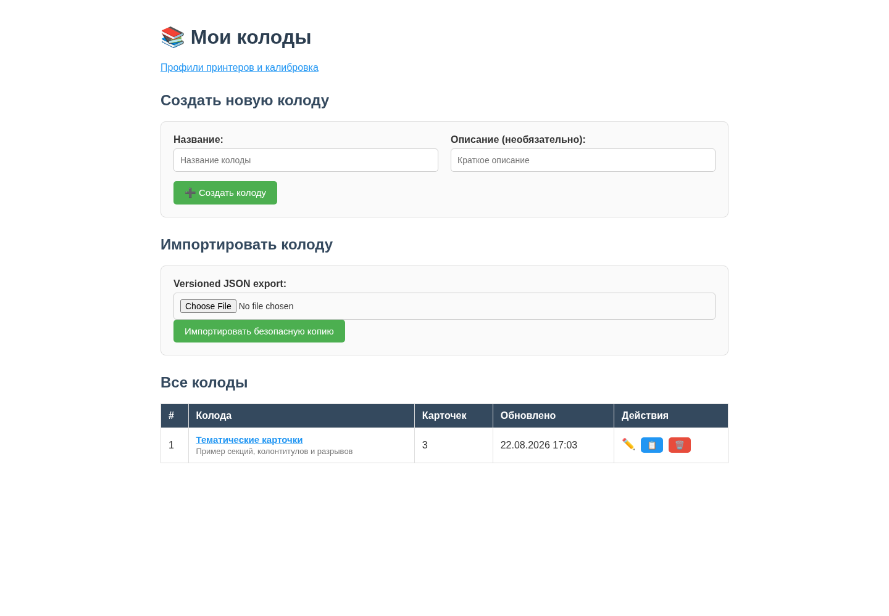
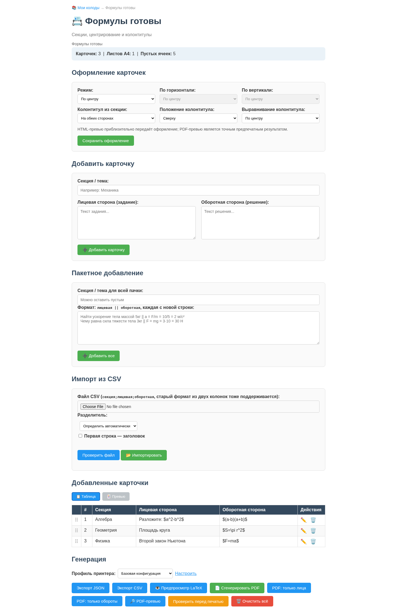
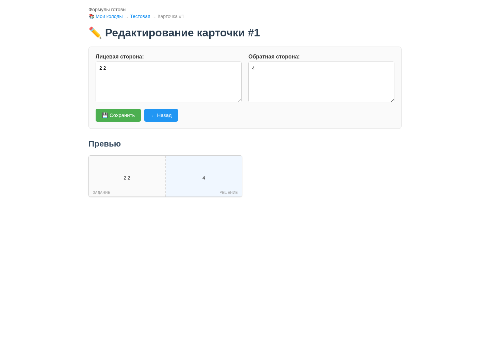
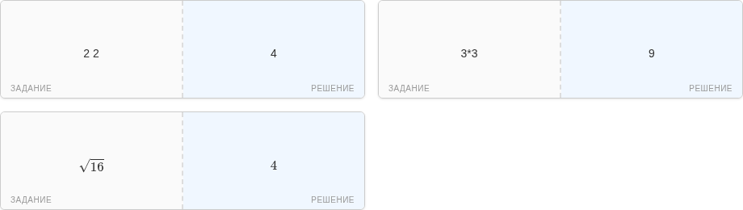
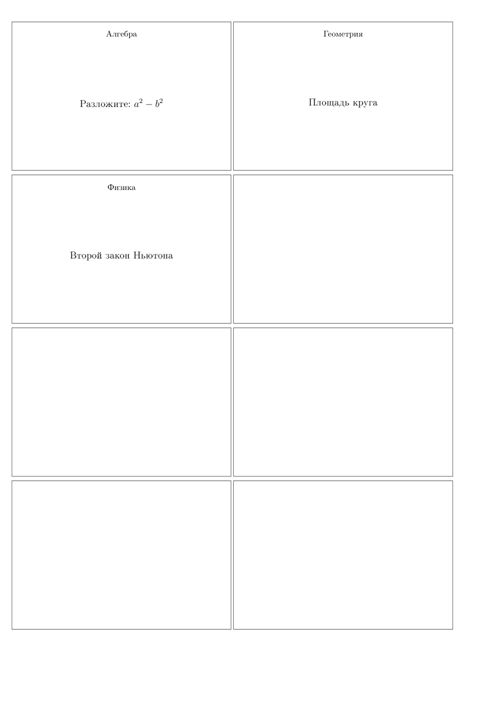
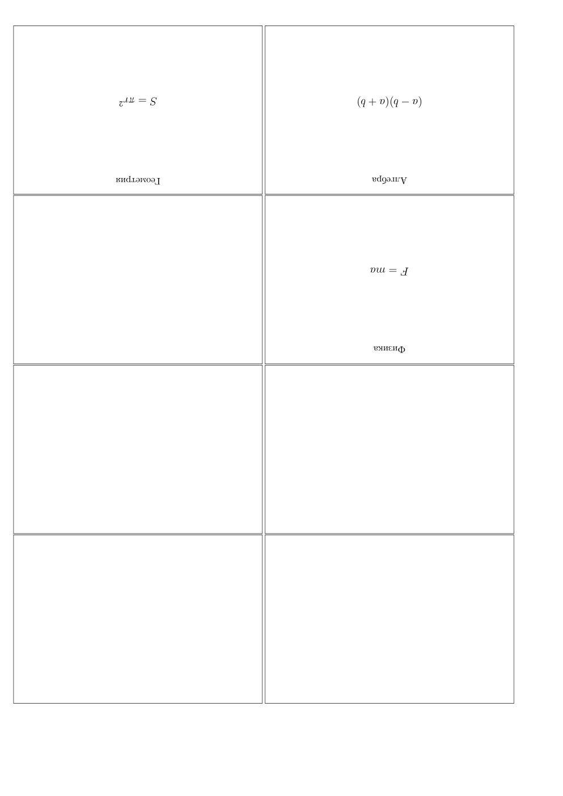

# Руководство пользователя и разработчика

## 1. Назначение и текущая готовность

Приложение хранит несколько колод, позволяет редактировать пары «задание — ответ» и генерирует A4 PDF размером 2 × 4 карточки. PDF строится не браузером: сервер экранирует текст, формирует LaTeX и запускает `pdflatex` во временном каталоге.

Текущая версия подходит для редактирования контента и технического просмотра LaTeX. Программные блокеры `BUG-PRINT-001…003` уже устранены: PDF чередует стороны каждого физического листа, поддерживает long-edge/short-edge transforms, независимые X/Y offsets, registration marks и трактует заданные сантиметры как внешний размер карточки. Для ответственной печати всё ещё нужна физическая проверка на целевом принтере — драйвер может добавлять собственное смещение подачи.

## 2. Установка

### Системные требования

- Python 3.11 или новее (аудит выполнен на Python 3.13.5);
- Flask 3.1;
- `pdflatex` и LaTeX-пакеты `extarticle`, `amsmath`, `mathtext`, `babel` с русским языком, `geometry`, `graphicx`, `enumitem`, `multicol`, `xcolor`;
- современный браузер; Chromium нужен только для регенерации скриншотов.

Установка и запуск:

```bash
python3 -m venv .venv
source .venv/bin/activate
python -m pip install -r requirements.txt
export DIDACTIC_CARDS_SECRET_KEY='replace-with-a-long-random-value'
python app/run.py
```

По умолчанию данные сохраняются в абсолютном пути `app/data`, поэтому каталог запуска не меняет выбранную базу. Для отдельной базы используйте, например, `DIDACTIC_CARDS_DATA_DIR=/srv/didactic-cards/data`; каталог будет приведён к абсолютному пути.

Проверка TeX:

```bash
pdflatex --version
kpsewhich mathtext.sty
kpsewhich babel-russian.tex
```

## 3. Работа с приложением

### Колоды

Стартовая страница создаёт, открывает, переименовывает, клонирует и удаляет колоды. Удаление необратимо: корзины и резервной копии пока нет.



Служебный хвост `HTML`, который был виден на исходном audit-снимке, удалён из шаблона; обновлённый screenshot регенерируется после browser-приёмки этапа 4.

### Добавление карточек

В редакторе доступны четыре пути:

1. Одна карточка — заполнить хотя бы одну сторону и нажать «Добавить карточку».
2. Пакетный ввод — одна карточка на строку.
3. CSV — первые две колонки интерпретируются как лицевая и оборотная стороны.
4. Редактирование уже добавленной карточки.



Спецификация импорта:

- bulk использует точный разделитель `||`; одиночный `|` остаётся текстом, `\||` вставляет буквальный `||`, `\\` — обратную косую черту;
- CSV должен быть в UTF-8/UTF-8-BOM; auto-mode распознаёт запятую, точку с запятой и tab, также доступен явный выбор;
- checkbox «Первая строка — заголовок» исключает header;
- «Проверить файл» ничего не записывает и показывает accepted/rejected counts; строка более чем с двумя колонками отклоняется, а непосредственный импорт такого файла целиком отменяется.

Пример bulk:

```text
Столица Франции || Париж
$2^5$ || $32$
```

или:

```csv
Столица Франции,Париж
$2^5$,$32$
```

### Формулы и превью

LaTeX-формулы задаются как `$...$` или `$$...$$`. Обычные символы `%`, `&`, `_`, `{`, `}` и другие сервер экранирует. Формулы проходят allowlist: поддерживаются дроби, корни, суммы/интегралы, сравнения, греческие буквы, стандартные функции, простое форматирование и интервалы. Файловые, процессные и macro-команды отклоняются до запуска TeX.



MathJax 3.2.2 вместе с web fonts хранится локально в static assets; приложение показывает явный статус загрузки и не требует CDN. PDF при установленном TeX формирует те же разрешённые формулы независимо от браузерного preview.



Неподдерживаемая команда или нарушенный баланс фигурных скобок возвращает диагностическую ошибку 422. Компилятор запускается с `-no-shell-escape -halt-on-error`.

### Генерация PDF

- «Предпросмотр LaTeX» показывает исходник.
- «PDF-превью» компилирует тот же документ и открывает inline PDF в модальном окне; это точнее декоративной HTML-сетки по шрифту, pagination и duplex-порядку.
- «Сгенерировать PDF» запускает `pdflatex` с таймаутом 30 секунд.
- Неполный лист дополняется пустыми ячейками до восьми карточек.
- Страницы идут парами физических листов: `front-1, back-1, front-2, back-2, …`.
- По умолчанию используется portrait long-edge: колонки оборота зеркальны, текст остаётся вертикальным. Short-edge доступен через `CardLayoutConfig.duplex_mode`.
- Кириллические названия файлов передаются через RFC 5987 `filename*`; это проверено как Flask contract-тестом, так и реальным Werkzeug/curl запросом.
- Колода ограничена 200 карточками, весь запрос — 2 MiB. Bulk/CSV при превышении лимита отклоняются целиком без частичной записи.
- HTML-формы защищены CSRF-токеном; API принимает JSON и возвращает структурированные 4xx-ответы.
- Ошибка содержимого возвращает 422, недоступный компилятор — 503, timeout — 504; внутренний TeX-лог в production-ответ не включается.

Лицевая страница реального PDF из аудита:



Оборотная страница той же колоды:



На обороте рамка по умолчанию невидима. Для long-edge колонки зеркальны, а текст остаётся вертикальным, как на обновлённом снимке. Печатать нужно с выбранным в приложении и драйвере одинаковым способом переворота, масштабом 100% / Actual size и без `Fit`. До добавления калибровки возможное аппаратное смещение нужно проверять пробным листом.

## 4. Хранение данных

Независимо от текущего рабочего каталога:

```text
app/data/cards.sqlite3        # активная транзакционная база
app/data/decks.json           # legacy JSON, сохраняется после миграции
app/data/cards/<deck-id>.json # legacy-карточки, сохраняются после миграции
app/data/legacy-json-backup-v1/ # снимок источника перед первым импортом
```

Активное хранилище — SQLite schema 1: `decks`, `cards`, упорядоченная связь `deck_cards(position)` и служебная `repository_meta`. Foreign keys включаются для каждого соединения, journal работает в WAL, а изменения колоды и карточек выполняются одной `BEGIN IMMEDIATE` транзакцией. Поэтому конкурентные процессы не теряют добавления, а исключение внутри mutation откатывает всю операцию.

Карточки во всех HTML/API URL адресуются стабильным UUID, а не текущим номером строки. Колода имеет монотонную `version`: UI отправляет прочитанную версию с add/edit/delete/reorder/reset, и устаревшая вкладка получает HTTP 409 вместо перезаписи более свежего состояния. Drag-and-drop отправляет упорядоченный список UUID; при сетевой/validation ошибке DOM возвращается в прежний порядок.

Если `cards.sqlite3` ещё нет, а `decks.json` существует, приложение сначала запускает полный read-only JSON integrity scan. Набор импортируется в одной SQLite-транзакции с сохранением UUID, порядка, timestamps и clone lineage. Единственное безопасно восстанавливаемое расхождение — устаревший денормализованный `card_ids`: порядок берётся из канонического card-файла, JSON не переписывается, а warning сохраняется в `repository_meta`. Любая structural/missing/orphan/duplicate ошибка блокирует импорт. Перед импортом исходники копируются в `legacy-json-backup-v1`; исходные JSON не удаляются. Метка в SQLite не позволяет повторно импортировать позднее изменённый JSON. База с более новой неизвестной версией схемы отклоняется без downgrade.

Legacy JSON schema 1 и его инструменты atomic replace/lock/`.bak` сохранены для аудита и восстановления миграционного источника. Они больше не являются рабочим backend после успешного импорта.

Проверка и контролируемое восстановление:

```bash
python scripts/check_storage.py
python scripts/check_storage.py \
  --backend json \
  --recover 'cards/<deck-id>.json' \
  --yes
```

В auto-режиме утилита выбирает SQLite, если `cards.sqlite3` уже существует. Recovery разрешён только с `--backend json` и только для `decks.json`, `repository.json` и JSON внутри `cards/`. Перед заменой команда проверяет соседний `.bak`, а текущий повреждённый файл перемещает в `.broken-<UTC timestamp>`. Это локальная последняя версия, а не полноценная стратегия backup: перед миграциями по-прежнему копируйте весь `app/data` во внешнее хранилище.

## 5. Архитектура

```text
Browser / HTML / JSON API
          |
      Flask blueprint
          |
  card/deck use cases
          |
  +-------+----------------+
  |                        |
SqliteRepository     LatexRenderer
  |                        |
JSON files             PdfLatexCompiler
                           |
                        A4 PDF
```

- `domain/entities.py`: карточка, метаданные колоды, рабочая `CardDeck`.
- `use_cases/`: CRUD, импорт, padding, preview и generate.
- `adapters/sqlite_repository.py`: активное transactional/WAL-хранилище и одноразовый legacy import.
- `adapters/json_repository.py`: проверка, backup и recovery исходного JSON.
- `adapters/latex_renderer.py`: физическая сетка и зеркалирование.
- `web/blueprint.py`: HTML и AJAX endpoints.
- `xelatex_compiler.py`: протестированная альтернативная реализация компилятора; активная конфигурация пока использует `pdflatex`.

`CardLayoutConfig` задаёт внешний cut size `9.3 × 6.3 см`, 2 столбца, 4 ряда, `fboxsep=8pt`, толщину рамки и `duplex_mode`. Внутренняя `minipage` автоматически уменьшается на padding и border, поэтому они не увеличивают физическую рамку. Поля `front_offset_x_mm`, `front_offset_y_mm`, `back_offset_x_mm`, `back_offset_y_mm` принимают калибровку в диапазоне ±10 мм; `registration_marks=True` добавляет кресты на обе стороны листа.

Рекомендуемый цикл калибровки:

1. Временно включить `back_border=True` и `registration_marks=True`.
2. Распечатать один лист в масштабе 100% выбранным duplex-режимом.
3. Измерить смещение оборота относительно лица по X/Y.
4. Внести компенсацию в `back_offset_x_mm`/`back_offset_y_mm`, повторить печать.
5. После проверки выключить отладочную рамку и registration marks при необходимости.

## 6. Тесты и воспроизводимость аудита

```bash
python -m pip install -r requirements-dev.txt
python -m pytest -q
python -m pytest --cov=didactic_cards --cov=run --cov=config --cov-branch
```

Все исходные `xfail(strict=True)` после исправлений сохранены как обычные regression-тесты; известных исполнимых дефектов без обычного passing contract больше нет.

Текущее состояние основного набора: 242 проходящих теста, 0 `xfail`, общий branch coverage 98.84%. Отдельный Chromium E2E покрывает create → add/formula → keyboard reorder → reload → UUID edit → CSV preview/import → PDF generate на временной SQLite-базе. Последний локальный rerun после финальной проверки offline resource URLs ожидает доступного socket/browser approval.

Скриншоты можно переснять на запущенном приложении:

```bash
python scripts/capture_screenshots.py \
  --base-url http://127.0.0.1:5000 \
  --deck-id <UUID-колоды> \
  --output-dir docs/images
```

Скрипт использует системный Chromium и не скачивает собственный браузер.

## 7. Диагностика

- `Exec format error` у `venv/bin/python`: удалите/не используйте непереносимое окружение и создайте `.venv` заново.
- `pdflatex not found`: установите TeX Live и проверьте `pdflatex --version`.
- Страница ошибки LaTeX: откройте полный лог, найдите первую строку, начинающуюся с `!`.
- Формулы видны как `$x^2$`: проверьте статус локального MathJax и HTTP-загрузку `/cards/static/vendor/mathjax/tex-mml-chtml.js`; это не обязательно означает сбой PDF.
- Колоды «пропали»: проверьте `DIDACTIC_CARDS_DATA_DIR`; без этой переменной приложение всегда использует `app/data`.
- Ошибка повреждения хранилища: сначала выполните `python scripts/check_storage.py` и скопируйте весь каталог; затем восстановите только указанный в отчёте файл через `--recover ... --yes` или вручную после проверки `.bak`.
- PDF не скачивается: проверьте HTTP-статус и первую диагностическую строку; кириллические имена поддерживаются.
