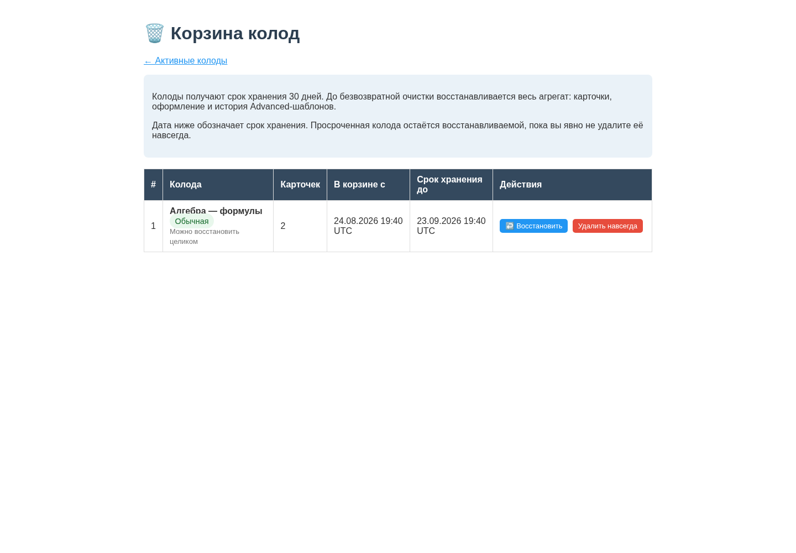
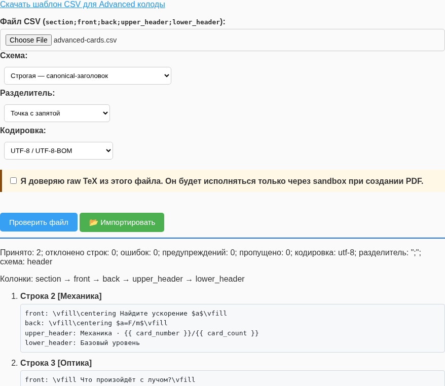
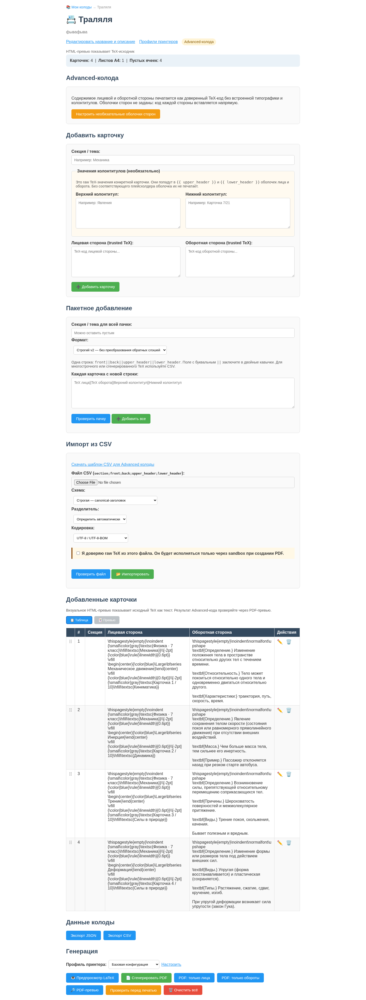
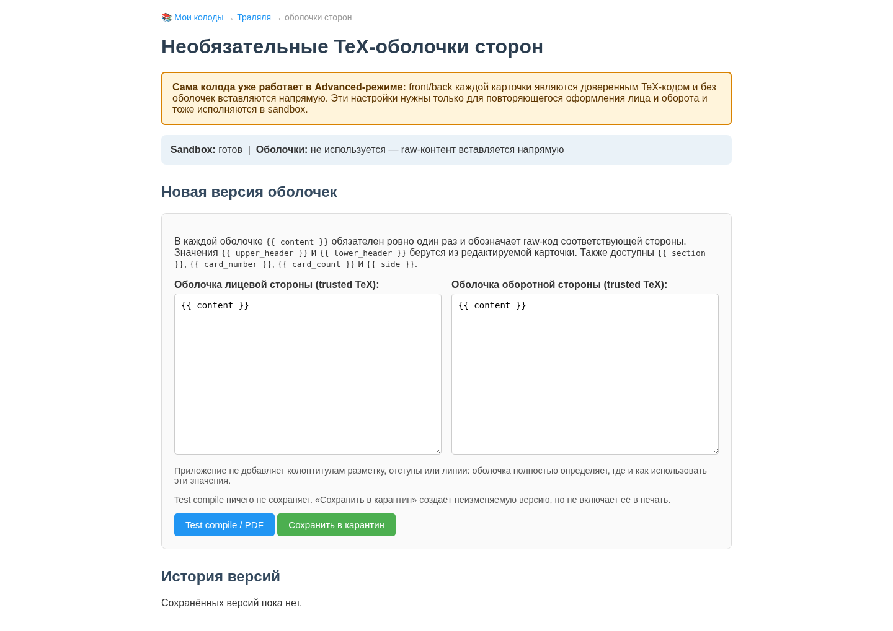

# Руководство пользователя и разработчика

## 1. Назначение и текущая готовность

Приложение хранит несколько колод, позволяет редактировать пары «задание — ответ» и генерирует A4 PDF размером 2 × 4 карточки. PDF строится не браузером: сервер экранирует текст, формирует LaTeX и запускает `pdflatex` во временном каталоге.

Текущая версия подходит для редактирования контента и технического просмотра LaTeX. Программные блокеры `BUG-PRINT-001…003` уже устранены: PDF чередует стороны каждого физического листа, поддерживает long-edge/short-edge transforms, независимые X/Y offsets, registration marks и трактует заданные сантиметры как внешний размер карточки. Для ответственной печати всё ещё нужна физическая проверка на целевом принтере — драйвер может добавлять собственное смещение подачи.

## 2. Установка

### Системные требования

- Linux и локальная POSIX-файловая система одного host; Windows, NFS/SMB и
  multi-host shared volumes не поддерживаются;
- Python 3.11 или новее (аудит выполнен на Python 3.13.5);
- Flask 3.1;
- `pdflatex` и LaTeX-пакеты `extarticle`, `amsmath`, `mathtext`, `babel` с русским языком, `geometry`, `graphicx`, `enumitem`, `multicol`, `xcolor`;
- современный браузер; Chromium нужен только для регенерации скриншотов.
- Linux `bubblewrap` нужен для advanced/trusted LaTeX; обычный безопасный режим от него не зависит.

Установка и запуск:

```bash
python3 -m venv .venv
source .venv/bin/activate
python -m pip install -r requirements.txt
export DIDACTIC_CARDS_SECRET_KEY='replace-with-a-long-random-value'
python app/run.py
```

Если ключ не задан при локальном запуске, приложение атомарно создаёт
`app/data/.secret_key` с правами `0600`. Один файл используется всеми Gunicorn
workers, поэтому подписанная сессия и CSRF-токен не зависят от того, какой worker
обработал следующий запрос. Для production следует всегда передавать стабильный
`DIDACTIC_CARDS_SECRET_KEY` через окружение или secret manager.

Встроенный сервер предназначен для локальной разработки и стартует без debug по умолчанию. Явно включить debug можно только переменной `DIDACTIC_CARDS_DEBUG=true`; значения кроме `true/false`, `yes/no`, `on/off`, `1/0` отклоняются, чтобы опечатка не включила небезопасный режим неожиданно.

Production-пример для Linux/WSL:

```bash
export DIDACTIC_CARDS_SECRET_KEY='replace-with-a-long-random-value'
export DIDACTIC_CARDS_DATA_DIR='/srv/didactic-cards/data'
.venv/bin/gunicorn \
  --chdir app \
  --workers 2 \
  --bind 127.0.0.1:8000 \
  --access-logfile - \
  --error-logfile - \
  'run:create_app()'
```

TLS и аутентификацию следует завершать на reverse proxy. Liveness probe — `GET /health/live`; readiness probe — `GET /health/ready`. Readiness возвращает 503, если SQLite integrity/write-transaction check или поиск настроенного TeX executable не прошёл. Ответ показывает только `storage`/`tex: ok|unavailable` и не раскрывает внутренние пути.

Advanced-режим по умолчанию закрыт. Явный `DIDACTIC_CARDS_TRUSTED_LATEX_ENABLED=true` требует установленный `bubblewrap`, показывает редактор в оформлении и добавляет readiness-компонент `trusted-tex-sandbox`; проверяется не только executable, но и реальное создание namespaces. Включение флага само по себе не меняет PDF. Для сетевого доступа обязательна внешняя аутентификация: приложение пока не различает владельца и других пользователей.

Каждый HTTP-ответ содержит новый UUID в `X-Request-ID`; страница ошибки показывает тот же код пользователю. Логи имеют однострочный JSON-формат. Событие `request_completed` содержит method/path/status/duration, а `pdf_compilation` — deck UUID, сторону (`duplex|front|back`), result/error kind и длительность. Содержимое карточек, TeX-log и filesystem paths в эти поля не записываются.

По умолчанию данные сохраняются в абсолютном пути `app/data`, поэтому каталог запуска не меняет выбранную базу. Для отдельной базы используйте, например, `DIDACTIC_CARDS_DATA_DIR=/srv/didactic-cards/data`; каталог будет приведён к абсолютному пути.

Проверка TeX:

```bash
pdflatex --version
kpsewhich mathtext.sty
kpsewhich babel-russian.tex
```

## 3. Работа с приложением

### Колоды

Стартовая страница создаёт, открывает, переименовывает, клонирует и перемещает колоды
в корзину. Ссылка «Корзина» показывает число удалённых колод. В ней можно атомарно
восстановить весь агрегат — карточки, оформление и историю Advanced-шаблонов — либо
отдельно удалить его навсегда. Обе операции защищены CSRF и версией колоды: действие
из устаревшей вкладки получает HTTP 409.

По умолчанию срок хранения равен 30 дням. Его можно задать переменной
`DIDACTIC_CARDS_TRASH_RETENTION_DAYS` в диапазоне 1–3650. Просроченная запись остаётся
восстанавливаемой до явного purge: фонового scheduler в локальном приложении нет.
Ручное «Удалить навсегда» доступно и до даты хранения, всегда отдельной операцией.
Корзина не входит в список активных колод и недоступна для просмотра, печати, clone,
экспорта или trusted API. `MAX_CARDS` остаётся лимитом изменения одной активной
колоды; restore не создаёт карточки заново и потому не применяет квоту повторно.




Служебный хвост `HTML`, который был виден на исходном audit-снимке, удалён из шаблона; актуальный screenshot переснят после успешной browser-приёмки.

### Добавление карточек

В редакторе доступны четыре пути:

1. Одна карточка — заполнить хотя бы одну сторону и нажать «Добавить карточку».
2. Пакетный ввод — быстрый ручной ввод с обязательной проверкой пачки.
3. CSV — строгий табличный импорт из другой программы или нейросети с обязательным preview.
4. Редактирование уже добавленной карточки.


В обычной колоде стороны являются безопасным текстом с явной структурой:

- один Enter создаёт принудительный перенос строки;
- пустая строка, в том числе содержащая только пробелы/tab, начинает новый абзац;
- несколько пустых строк подряд дают одну границу абзаца, а пустые строки до первого
  и после последнего символа не создают искусственный вертикальный отступ;
- `CRLF`, одиночный `CR` и `LF` выглядят одинаково, но SQLite/CSV/JSON хранят исходную
  строку без переписывания;
- `$$...$$` является отдельным математическим блоком; многострочная inline-формула
  `$...$` не поддерживается, поэтому её следует записать в одну строку;
- Markdown и автоматические списки не интерпретируются: дефис, маркер и номер остаются
  обычным текстом, а строки простого списка разделяются Enter.

Например, следующий текст содержит две строки первого абзаца и второй абзац:

```text
Сформулируйте второй закон Ньютона.
Запишите формулу.

Используйте обозначения из условия.
```

Настройка межабзацного интервала (`нет / небольшой / средний`) применяется к этой
границе одинаково в HTML-preview и PDF. Safe-renderer экранирует текст до добавления
собственных команд строк и абзацев; строка вроде `[30mm]` не может стать параметром
LaTeX. При ручном изменении браузерное `textarea` использует LF, но сохранение без
изменений не переписывает импортированные CRLF/CR. Advanced-стороны и их raw-поля
остаются посимвольным TeX и полностью обходят этот formatter.

Спецификация пакетного ввода:

- строгий формат не интерпретирует обратный слэш: для обычной колоды строка имеет вид
  `front||back`, для Advanced — `front||back||upper_header||lower_header`;
- поле с буквальным `||` заключается в двойные кавычки, а буквальная двойная кавычка
  внутри него удваивается;
- реальный многострочный raw TeX следует импортировать через CSV;
- физические границы карточек — только `CRLF`, `LF` и `CR`; Unicode-символы NEL,
  line separator и paragraph separator остаются частью поля, а не скрытой новой карточкой;
- «Проверить пачку» показывает распознанные поля и ошибки. Любое изменение текста,
  секции или версии колоды сбрасывает разрешение на добавление.

Строгая CSV-схема использует canonical ASCII-заголовки в произвольном порядке:

- обычная колода: обязательные `front`, `back`, необязательная `section`;
- Advanced: обязательные `front`, `back`, необязательные `section`, `upper_header`,
  `lower_header`;
- неизвестная, повторная, пустая или отсутствующая обязательная колонка отклоняет файл;
- значения сохраняются посимвольно, включая внешние пробелы, обратные слэши, delimiter,
  кавычки и переводы строк quoted cell; Safe-интерпретация строк происходит только
  позже при preview/PDF;
- поддерживаются `;`, `,`, tab; UTF-8/BOM, UTF-16 по BOM и явно выбранная Windows-1251;
- первая строка всегда является заголовком; positional-файлы без заголовка отклоняются.

Если разделителем выбрана запятая, запятая внутри значения должна быть заключена в
двойные кавычки: `Math,"\\text{a, b}",Answer`. В файле с разделителем `;` обычная
запятая является частью значения и quoting для неё не требуется. Незакавыченный
разделитель создаёт лишнюю колонку: preview отклонит строку целиком, а не импортирует
искажённую карточку. Поля с переводом строки всегда должны быть quoted; `"` внутри
quoted-поля записывается как `""`.

Preview показывает mapping, encoding, номера строк, все поля, errors/warnings и
усечение списка. Он не исполняет TeX и ничего не записывает. Импорт доступен только для
того же файла, параметров и версии колоды; сервер повторно разбирает байты и записывает
все карточки одной транзакцией. Для Advanced дополнительно требуется подтвердить
доверие raw TeX. Последующая компиляция всё равно идёт только через sandbox.

Канонический export намеренно не добавляет апострофы к значениям, начинающимся с
`=`, `+`, `-` или `@`: такая «защита» изменила бы raw round-trip. Не открывайте
недоверенный CSV в электронной таблице, способной вычислять формулы; preview приложения
показывает значения как обычный текст и ничего не исполняет.

Поле «Секция / тема» сохраняется вместе с карточкой. В одиночной и пакетной формах его можно задать непосредственно; пакетная форма назначает одну секцию всей добавляемой пачке. При редактировании секция меняется вместе со сторонами карточки.

Raw-поля карточки `upper_header/lower_header` принадлежат только Advanced-типу.
Обычная колода не показывает их и принимает на API/JSON/storage boundary лишь точную
пустую строку; пробел, tab или перевод строки уже считаются raw-содержимым и
отклоняются атомарно. Это не те же поля, что встроенные верхний/нижний колонтитулы
обычной колоды: Safe-колонтитулы являются настройками всей колоды и проходят
экранированный allowlisted renderer.

Пример bulk:

```text
Столица Франции||Париж
$2^5$||$32$
```

или:

```csv
section;front;back
География;Столица Франции;Париж
Математика;$2^5$;$32$
```

Готовые файлы-примеры: [обычная колода](examples/safe-cards.csv) и
[Advanced-колода](examples/advanced-cards.csv).



Для генератора/нейросети можно использовать короткое задание: «Верни CSV в UTF-8 с
разделителем `;` и точным заголовком
`section;front;back;upper_header;lower_header`. Каждая строка — одна карточка; TeX не
экранируй; delimiter, кавычки и многострочный текст оформляй стандартным CSV quoting».
Загруженные значения подставляются в уже настроенные оболочки целевой колоды. CSV не
переносит тип колоды, оболочки, историю доверия, оформление или профиль принтера.

### Оформление и колонтитулы

Панель «Оформление обычной колоды» принадлежит колоде и не изменяет физический профиль принтера. В Advanced-колоде этой панели нет:

- `По центру` центрирует body по обеим осям и используется для новых колод;
- `Настроить вручную` открывает независимый выбор слева/по центру/справа и сверху/по центру/снизу — всего девять комбинаций;
- верхний и нижний колонтитулы занимают фиксированные семантические полосы; каждый можно выводить на лицах, оборотах или обеих сторонах и выравнивать независимо;
- источник каждого колонтитула выбирается из безопасных значений: секция, логический номер карточки или текстовый шаблон длиной до 200 символов. В шаблоне доступны только `{{ card_number }}` и `{{ card_count }}`, например `Явления · Карточка {{ card_number }}/{{ card_count }}`;
- верхний и нижний колонтитулы независимо отделяются тонкой или средней горизонтальной линией; отступ выбирается из трёх фиксированных вариантов и входит в расчёт доступной высоты body;
- повтор каждого колонтитула настраивается отдельно: на каждой карточке либо только на первой карточке каждого непрерывного блока секции;
- «Новая секция начинается» оставляет карточки подряд либо добавляет пустые физические позиции до новой строки или нового листа. Секция и safe-колонтитулы являются однострочными метками: переводы строк при показе сворачиваются в пробел, и сравнение границ использует ту же видимую форму. Поэтому эквивалентные LF/CRLF не создают ложный разрыв физического листа; сохранённое импортом значение при этом не переписывается.

Типографика включается отдельным профилем и потому не меняет прежний документ скрытно:

- `Выключено` оставляет исторические `normal/small/footnotesize/scriptsize` и прежний auto-fit;
- `Книжный`, `Крупный sans-serif` и `Компактный` — фиксированные проверенные наборы;
- `Настроить вручную` разрешает семейство serif/sans/mono, три размера, обычный/полужирный текст, прямой/курсивный стиль, межстрочный и межабзацный интервалы; шрифт двух колонтитулов задаётся независимо.

Все поля являются enum или обычным экранированным текстом. Приложение само строит локальные команды `fontsize/family/series/shape`; в форму нельзя передать пакет, команду или произвольную директиву LaTeX. Auto-fit меняет размер внутри выбранного семейства и начертания. Advanced-колода по определению обходит весь built-in слой, даже если общая TeX-оболочка не задана.

Пустые позиции разрыва создаются в физической модели лицевой страницы до перестановки оборотов и потому участвуют в duplex pairing. Счётчики листов/пустых ячеек и preflight используют эту же раскладку; preflight отдельно сообщает позиции, добавленные разрывами, и хвост последнего листа. Колонтитул занимает фиксированную полосу на тех карточках, где он показан; для него действуют отдельные auto-fit и horizontal/vertical overflow markers. Настройки сохраняются с optimistic version check: устаревшая вкладка не перезапишет более свежий стиль.

HTML-сетка использует те же семантические настройки и удобна для быстрой работы, но отличается браузерными шрифтами и остаётся приблизительной. Встроенный PDF-preview компилирует настоящий print job и является точным предпечатным результатом.

### Advanced / trusted LaTeX

Этот тип колоды предназначен только для локального доверенного автора. После установки `bubblewrap` и запуска с `DIDACTIC_CARDS_TRUSTED_LATEX_ENABLED=true` в форме создания появляется выбор «Advanced». Это тип колоды, а не переключатель: изменить его после создания нельзя. При выключенном flag новую Advanced-колоду создать нельзя, а печать уже существующей блокируется fail closed.





Текст front/back каждой карточки всегда вставляется как raw trusted TeX внутрь app-owned области карточки. Оболочки лица и оборота необязательны: без них код соответствующей стороны печатается напрямую; с ними можно один раз задать разное повторяющееся оформление двух сторон. Оболочки не управляют A4-страницей, cut box, duplex-перестановкой или printer profile. В каждой доступны:

- `{{ content }}` — содержимое стороны, обязательно ровно один раз;
- `{{ section }}` — всегда экранированная секция;
- `{{ card_number }}` — логический номер карточки;
- `{{ card_count }}` — число реальных карточек без технических padding-позиций;
- `{{ side }}` — `front` либо `back`;
- `{{ upper_header }}` и `{{ lower_header }}` — raw TeX-значения верхнего и нижнего колонтитула конкретной карточки. Внутри них тоже разворачиваются `section`, `card_number`, `card_count` и `side`.

При добавлении и редактировании Advanced-карточки поля колонтитулов необязательны. Они недоступны у Safe-карточки не только визуально: HTML/API, use cases, JSON import и SQLite-запись отклоняют непустое значение. Приложение не резервирует под raw-поля место, не добавляет линию и не выбирает шрифт: если оболочка не содержит соответствующий плейсхолдер, значение вообще не печатается. Значение остаётся raw TeX: приложение заменяет в нём только известные точные контекстные маркеры, а остальные команды и группировки не интерпретирует. Например, код `\vfill\centering Вопрос\vfill` можно записать прямо в front. Если такое обрамление нужно всем лицам, его удобнее вынести в оболочку лица `\vfill\centering {{ content }}\vfill`, а обороту задать другую. Ни escaped/raw selector, ни built-in header/alignment/типографика на Advanced-экране не показываются. HTML-превью показывает исходник как текст; точный результат смотрите в PDF-preview.

Рабочий порядок защищает от случайной активации:

1. `Test compile / PDF` собирает текущий несохранённый текст в sandbox и ничего не записывает.
2. «Сохранить в карантин» создаёт новую неизменяемую пару оболочек с общим SHA-256, но печать пока продолжает использовать предыдущую approved-версию либо raw без оболочек.
3. В истории отметьте явное согласие и нажмите «Test compile и активировать». Не прошедшая sandbox/readiness или compilation версия не активируется.
4. В каждый момент активна максимум одна пара оболочек; новая отзовёт предыдущую. «Отключить оболочки» отзывает активную версию, сохраняя историю и direct raw-печать.

Каждая печать получает одним SQLite read snapshot карточки, настройки, deck version и точную approved-версию шаблона. Поэтому параллельное редактирование не смешивает состояния. Ошибка trusted TeX связывается с номером карточки и стороной без показа host paths или полного sandbox-log.

### Формулы и превью

LaTeX-формулы задаются как `$...$` или `$$...$$`. Обычные символы `%`, `&`, `_`, `{`, `}` и другие сервер экранирует. Формулы проходят allowlist: поддерживаются дроби, корни, суммы/интегралы, сравнения, греческие буквы, стандартные функции, простое форматирование и интервалы. Файловые, процессные и macro-команды отклоняются до запуска TeX.


MathJax 3.2.2 вместе с web fonts хранится локально в static assets; приложение показывает явный статус загрузки и не требует CDN. PDF при установленном TeX формирует те же разрешённые формулы независимо от браузерного preview.


Неподдерживаемая команда или нарушенный баланс фигурных скобок возвращает диагностическую ошибку 422. Компилятор запускается с `-no-shell-escape -halt-on-error`.

### Генерация PDF

- Перед генерацией выберите профиль принтера. Встроены «Стандартный long-edge», «Калибровочный long-edge» с рамками/метками и «Стандартный short-edge»; «Базовая конфигурация» использует поля `CardLayoutConfig` без переопределения.
- «Предпросмотр LaTeX» показывает исходник.
- «PDF-превью» компилирует тот же документ и открывает inline PDF в модальном окне; это точнее декоративной HTML-сетки по шрифту, pagination и duplex-порядку.
- «Сгенерировать PDF» запускает `pdflatex` с таймаутом 30 секунд.
- «PDF: только лица» и «PDF: только обороты» создают два согласованных файла для принтера без автоматического duplex. В обоих файлах один PDF-лист соответствует одному и тому же физическому листу колоды; обороты используют ту же выбранную permutation и калибровочные offsets, что и полный duplex PDF.
- «Проверить перед печатью» выполняет read-only компиляцию и показывает пустые стороны, неполный последний лист, выход настроенной сетки за printable area, неподдерживаемые формулы, отсутствующие glyphs и horizontal/vertical overflow body или колонтитула. Результат автоматически получает focus и прокручивается в видимую область. Ошибки измеряются внутри конкретной карточки и привязаны к её номеру, стороне и ссылке редактирования; служебные предупреждения внешней TeX-сетки игнорируются. Колода и её `version` не меняются.
- Auto-fit включён по умолчанию: если сторона не помещается при 12pt, TeX последовательно пробует `small`, `footnotesize` и `scriptsize`. Preflight показывает применённое уменьшение как адресный warning. Если содержимое не помещается и на `scriptsize`, это остаётся error — текст следует сократить; молчаливого clipping нет. Deployment может отключить политику через `CardLayoutConfig(auto_fit=False)`.
- Неполный лист дополняется пустыми ячейками до восьми карточек.
- Страницы идут парами физических листов: `front-1, back-1, front-2, back-2, …`.
- По умолчанию используется portrait long-edge: колонки оборота зеркальны, а содержимое каждой оборотной карточки поворачивается на 180°. Перестановка ячеек (`duplex_mode`) и ориентация содержимого (`back_rotation_deg`) независимы; профиль может выбрать 0° или 180°.
- Кириллические названия файлов передаются через RFC 5987 `filename*`; это проверено как Flask contract-тестом, так и реальным Werkzeug/curl запросом.
- Колода ограничена 200 карточками, весь запрос — 2 MiB. Bulk/CSV при превышении лимита отклоняются целиком без частичной записи.
- HTML-формы защищены CSRF-токеном; API принимает JSON и возвращает структурированные 4xx-ответы.
- Ошибка содержимого возвращает 422, недоступный компилятор — 503, timeout — 504; внутренний TeX-лог в production-ответ не включается.

Лицевая страница реального PDF из аудита:


Оборотная страница той же колоды:


На обороте рамка по умолчанию невидима. Стандартный long-edge восстанавливает поворот содержимого на 180°, использовавшийся в первой версии приложения; профиль «Стандартный short-edge» использует 0°. Пользовательский профиль может выбрать оба варианта независимо от способа перестановки ячеек. Печатать нужно с выбранным в приложении и драйвере одинаковым способом переворота, масштабом 100% / Actual size и без `Fit`. Аппаратное смещение и направление стрелки «ВЕРХ КАРТОЧКИ» проверяются калибровочным PDF со страницы профилей.

Для ручной двусторонней печати сначала скачайте оба раздельных PDF и сделайте пробу на одном физическом листе:

1. Напечатайте первую страницу файла `*-fronts.pdf` при масштабе 100% / Actual size.
2. Не меняя ориентацию листа случайно, верните его во входной лоток способом, указанным для вашей модели принтера. Направление подачи и сторона, обращённая вверх, различаются между моделями, поэтому сначала пометьте карандашом верх листа.
3. Напечатайте первую страницу `*-backs.pdf` с теми же форматом бумаги, ориентацией, масштабом и layout-профилем.
4. Проверьте соответствие пары, направление текста и registration marks. Только после этого печатайте всю пачку.
5. Если драйвер выдаёт листы в обратном порядке, включите обратный порядок страниц только для второго прохода. Не переставляйте страницы внутри PDF: их номера уже сопоставлены по физическим листам.

Выбранный профиль применяется одинаково к LaTeX preview, полному/раздельным PDF и preflight. Для каждого HTTP-запроса создаётся отдельный renderer, поэтому одновременная печать с разными профилями не смешивает offsets или поворот. Дополнительные deployment-профили задаются в `AppConfig(printer_profiles=(PrinterProfile(...), ...))`. «Предустановленный профиль приложения» не является настройкой драйвера или памяти принтера: это только набор параметров генерации PDF. Страница «Профили принтеров и калибровка» сохраняет пользовательские измерения в SQLite: ключ — lowercase slug, имя ограничено 100 символами, поворот оборота — 0°/180°, offsets — диапазоном ±10 мм. Предустановленные профили нельзя перезаписать или удалить.


## 4. Хранение данных

Независимо от текущего рабочего каталога:

```text
app/data/cards.sqlite3        # активная транзакционная база
```

Активное хранилище — только SQLite schema 15: `decks`, `cards`,
упорядоченная связь `deck_cards(position)`, `deck_render_settings`,
`printer_profiles`, карантин `trusted_templates` и журнал
`schema_migrations`. Схема помечена фиксированным SQLite `application_id`:
файл чужого приложения с `user_version=0` не будет молча принят или
дополнен таблицами. Foreign keys включены для каждого соединения, journal
работает в WAL, а каждая серия чтений или записей имеет единый
транзакционный snapshot.

Пустой файл создаётся сразу в schema 15. Из старых баз автоматически
поддерживаются только точные schema 12, 13 и 14. При первом старте приложение:

1. проверит таблицы, индексы и metadata исходной schema;
2. создаст в `app/data/backups` проверенный
   `pre-migration-v12-stable.sqlite3`, `pre-migration-v13-stable.sqlite3` либо
   `pre-migration-v14-stable.sqlite3`
   с manifest или проверит/повторно
   использует уже созданную копию после failed-start;
3. выполнит цепочку 12→13→14→15, 13→14→15 либо шаг 14→15 в одной write-транзакции;
4. в шаге 13→14 приведёт `upper_header/lower_header` Safe-карточек к точной
   пустой строке, не меняя body, секцию, порядок, версии/timestamps и все пять
   полей Advanced-карточек. Исходные legacy-значения остаются в backup;
5. в шаге 14→15 добавит `trashed_at/purge_after` и индекс корзины. Все существующие
   колоды останутся активными; карточки и trusted history не переписываются.

Перед первым запуском schema-15 кода остановите **все** workers прежней
schema-12/13/14 версии. Rolling upgrade со смешанными версиями небезопасен: старый
процесс не знает о schema 15 и trash-инварианте. Только после успешного
однократного startup запускайте остальные workers новой версии.

Базы ниже schema 12, будущие версии и неполные/неизвестные схемы
отклоняются без изменения файла.

Новый data directory создаётся с режимом `0700`; SQLite main/WAL/SHM и
локальный `.secret_key` приводятся к `0600`. Существующий внешний
каталог намеренно не получает новый mode целиком: администратор должен
явно настроить ownership и права его родителей.

Координация не зависит от удаляемых `.lock`-файлов: schema lease берёт
`flock` на inode каталога, runtime lease — на inode активной базы. Этот
контракт рассчитан только на один Linux-host и локальную POSIX FS. NFS,
SMB, Windows и одновременный доступ с нескольких hosts не поддерживаются.

Trusted-шаблон хранится отдельно как неизменяемая версия с SHA-256, provenance (`local-author`, `imported`, `cloned`) и состоянием `quarantined`, `approved` либо `revoked`. В колоде одновременно может быть не более одной явно одобренной версии. Клон и JSON-import сохраняют историю исходников, но все копии снова помещают в карантин. Advanced CSV может содержать raw TeX полей карточки, но никогда не переносит оболочки и их approval/history. Integrity/readiness проверяет hash каждой сохранённой версии.

Карточки во всех HTML/API URL адресуются стабильным UUID, а не текущим номером строки. Колода имеет монотонную `version`: UI отправляет прочитанную версию с add/edit/delete/reorder/reset, и устаревшая вкладка получает HTTP 409 вместо перезаписи более свежего состояния. Drag-and-drop отправляет упорядоченный список UUID; при сетевой/validation ошибке DOM возвращается в прежний порядок.

### Экспорт и безопасный импорт колоды

В редакторе доступны два download:

- versioned JSON schema 8 содержит deck/card UUID, тип колоды, тексты, секции, значения колонтитулов карточек, safe-настройки и историю пар trusted-оболочек/provenance без approval; принимается только schema 8, а все импортированные оболочки получают provenance `imported` и `quarantined`. Для Safe оба raw-поля карточки могут отсутствовать или быть только точной пустой строкой; любое содержимое отклоняет весь import до записи. Safe payload с `trusted_templates` также отклоняется и никогда автоматически не повышается до Advanced;
- UTF-8-BOM CSV использует `;` и стандартное quoting для delimiter/multiline. Обычная колода экспортирует `section;front;back`, Advanced — `section;front;back;upper_header;lower_header`; повторный импорт в колоду того же типа сохраняет значения посимвольно. CSV остаётся форматом строк карточек, а не полным backup колоды;

На странице списка колод JSON export можно импортировать обратно. Импорт никогда не перезаписывает существующую колоду: создаются новые UUID, `parent_id` новой колоды и карточек указывают на исходные UUID. Schema/type/quota/duplicate-ID validation выполняется до записи, а создание deck + cards проходит одной транзакцией; при ошибке не остаётся пустой или частично импортированной колоды. Секция и настройки оформления одинаково применяются в HTML и TeX после импорта.

Операции над всей базой не следует путать с JSON/CSV export колоды.
CLI примет `DIDACTIC_CARDS_DATA_DIR`; тот же каталог можно явно передать каждой
команде через `--data-dir /absolute/path`.

### Read-only inspect

```bash
python scripts/storage.py inspect
# или проверить явно указанный файл:
python scripts/storage.py inspect --database /safe/place/cards.sqlite3
```

`inspect` открывает только существующий regular file в SQLite read-only/query-only mode.
Он не создаёт пустую базу при опечатке в пути. JSON-отчёт показывает
`user_version`, ожидаемую версию, structure/integrity/FK/semantic issues, счётчики,
размер, SHA-256 и наличие WAL. Код возврата `0` означает healthy, `1` —
найдена проблема в самой базе.

При активном WAL SQLite может обновить служебные read marks в уже существующем
`-shm`, но main/WAL и логические данные не изменяются. Непустой WAL без `-shm`
инспектор намеренно отклоняет, чтобы не создавать sidecar под видом read-only.

Поле `sha256` здесь — fingerprint только main-файла в момент отчёта.
`logical_sha256` хеширует схему и строки одного транзакционного read-snapshot и
поэтому учитывает committed-данные из WAL. Для переносимого автономного файла
всё равно создайте backup.

### Online backup

```bash
# автоимя в app/data/backups
python scripts/storage.py backup

# или явная новая цель
python scripts/storage.py backup --output /safe/place/cards.sqlite3
```

Останавливать сервер для backup не нужно: SQLite backup API снимает один
целостный snapshot и включает committed-данные из WAL. Перед публикацией
копия проходит те же structure/integrity/semantic checks. Файл и соседний
`*.manifest.json` публикуются только после проверки и имеют права `0600`; manifest содержит
формат, UTC-время, schema version, размер, байтовый `sha256` и
`logical_sha256`. Существующий backup
или manifest никогда не перезаписываются: локальная hard-link publication
атомарно откажет при destination race. Это ещё одна причина размещать output на
локальной POSIX FS, а не на NFS/SMB.

Храните хотя бы одну копию вне хоста приложения: локальный `app/data/backups`
не защищает от потери всего диска. SQLite backup не включает `.secret_key`; ключ
нужно хранить отдельно в secret manager или как environment secret.

### Offline restore

Восстановление заменяет активную базу. Остановите **все** Flask/Gunicorn workers
и только после этого выполните:

```bash
python scripts/storage.py inspect --database /safe/place/cards.sqlite3
python scripts/storage.py restore /safe/place/cards.sqlite3 --yes
python scripts/storage.py inspect
```

`--yes` обязателен; без него CLI ничего не меняет. Каждый запущенный worker
держит shared runtime lease; restore пытается взять exclusive lease и откажется,
если хотя бы один процесс ещё работает. Источник проверяется до касания
live-базы; соседний manifest обязателен, а его hash/schema/size обязаны совпасть.
Перед заменой создаётся проверенный `pre-restore-*` backup текущего состояния,
кандидат ставится через staged-файл и повторно проверяется. `.secret_key` и другие
файлы каталога данных restore не заменяет. Backup schema 12, 13 или 14 с корректным
manifest допустим: миграция до schema 15 выполняется в staged-копии,
а не в файле источника. Поэтому restore не переписывает старый backup; при
восстановлении schema 13 его legacy Safe-поля очищаются только в новой live-копии.

Если `inspect` показывает, что live DB unhealthy, обычный restore намеренно
откажется: это защита от неявной потери артефактов. После остановки всех
workers, проверки backup и осознанного решения запустите opt-in disaster recovery:

```bash
python scripts/storage.py restore /safe/place/cards.sqlite3 \
  --yes --allow-unhealthy-live
```

До касания live-семейства CLI скопирует каждый существующий main/WAL/SHM/journal
в private-каталог `backups/forensic-<UTC>-<id>/`, запишет для каждого файла
размер/SHA-256 в `forensic-manifest.json` и вернёт путь в JSON-поле
`forensic_bundle`. Bundle directory имеет `0700`, его файлы — `0600`. При
провале post-restore validation код попытается вернуть исходное семейство из bundle;
сам bundle не удаляется автоматически.

## 5. Архитектура

```text
Browser / HTML / JSON API
          |
      Flask blueprint
          |
  card/deck use cases
          |
  +-------+----------------+
  |                        |
SqliteRepository     LatexRenderer
  |                        |
cards.sqlite3          PdfLatexCompiler
                           |
                        A4 PDF
```

Trusted-контур передаёт immutable job с UUID/schema/source hash в `SandboxedPdfLatexCompiler`. Тот запускает `pdflatex -no-shell-escape` через `bubblewrap`: новые namespaces, очищенное окружение, read-only TeX runtime, единственный writable job directory и отдельный tmpfs. Применяются wall/CPU/RAM/process/file-size/descriptor limits, ограничение source/PDF/log и гарантированная очистка. Недоступная изоляция даёт fail-closed отказ; обычный `PdfLatexCompiler` остаётся неизменным.

- `domain/entities.py`: карточка, метаданные колоды, рабочая `CardDeck`.
- `use_cases/`: CRUD, импорт, padding, preview и generate.
- `adapters/sqlite_repository.py`: единственное transactional/WAL-хранилище.
- `adapters/latex_renderer.py`: физическая сетка и зеркалирование.
- `web/blueprint.py`: HTML и AJAX endpoints.
- `xelatex_compiler.py`: протестированная альтернативная реализация компилятора; активная конфигурация пока использует `pdflatex`.

`CardLayoutConfig` задаёт внешний cut size `9.3 × 6.3 см`, 2 столбца, 4 ряда, `fboxsep=8pt`, толщину рамки, базовый `duplex_mode` и `back_rotation_deg`. Внутренняя `minipage` автоматически уменьшается на padding и border, поэтому они не увеличивают физическую рамку. `PrinterProfile` переопределяет duplex mode, поворот содержимого оборота, рамку, метки и поля `front_offset_x_mm`, `front_offset_y_mm`, `back_offset_x_mm`, `back_offset_y_mm` в диапазоне ±10 мм; размеры и сетка остаются общими для приложения.

Рекомендуемый цикл калибровки:

1. На странице профилей выберите базовый или сохранённый профиль и скачайте двухстраничный calibration PDF.
2. Напечатайте обе страницы на одном физическом листе с масштабом 100% / Actual size, без Fit/Shrink и с тем же `long-edge` либо `short-edge`, который выбран в приложении. Проверьте, что стрелка «ВЕРХ КАРТОЧКИ» на обороте ориентирована ожидаемо; иначе смените поворот 0°/180°, не меняя калибровочные offsets.
3. Измерьте контрольный отрезок: он должен быть ровно 100 мм. Если длина иная, сначала отключите масштабирование драйвера — offsets не исправляют scale.
4. Держите лист лицом к себе на просвет. У центральной мишени измерьте положение пунктирного пурпурного креста оборота относительно сплошного чёрного: вправо/вниз — положительные X/Y, влево/вверх — отрицательные.
5. Для `long-edge`: новое `back_offset_x_mm = старое + X`, новое `back_offset_y_mm = старое − Y`. Для `short-edge`: новое `back_offset_x_mm = старое − X`, новое `back_offset_y_mm = старое + Y`.
6. Чтобы не ошибиться в знаках, введите X/Y во встроенный «Калькулятор компенсации». Он учитывает режим выбранного профиля, показывает новые «Оборот X/Y» и не сохраняет их без вашего решения.
7. Сохраните профиль, скачайте лист с ним и повторите проверку. Четыре угловые пары мишеней помогают отличить равномерный сдвиг от перекоса подачи бумаги.

Финальная физическая приёмка выполняется по отдельному [протоколу](PHYSICAL_PRINT_ACCEPTANCE.md): automatic long-edge, automatic short-edge и два раздельных PDF при ручной подаче. Рекомендуемые пределы — 99,5–100,5 мм для контрольного отрезка, остаток не более 0,5 мм в центре и 1 мм на угловых мишенях. Эти числа являются критериями проекта, а не заявленной точностью конкретного принтера.

## 6. Тесты и воспроизводимость аудита

```bash
python -m pip install -r requirements-dev.txt
python -m pytest -q
python -m pytest --cov=didactic_cards --cov=run --cov=config --cov-branch
```

Все исходные `xfail(strict=True)` после исправлений сохранены как обычные regression-тесты; известных исполнимых дефектов без обычного passing contract больше нет.

Текущее состояние полного набора фиксируется после каждого полного CI-прогона; `xfail` нет, branch coverage не ниже обязательного порога 98%. Storage-матрица включает SQLite 12→13→14→15, отдельные 13→14→15 и 14→15, stable migration retry, mode-aware cleanup, trash metadata integrity, staged restore старых backup, WAL snapshot, no-clobber backup, manifest mismatch, inode leases и publish-failure rollback. Остальной набор покрывает JSON schema 8, hard split Safe/Advanced, атомарные trash/restore/purge со stale-version и quota semantics, mode-aware CSV, Safe newline semantics, sandbox, PDF-геометрию, типографику, calibration и production health. Chromium E2E проходит forged Safe raw-field rejection, оформление обоих режимов, CSV round-trip, клавиатурное восстановление из корзины, purge, preflight и calibration UI.

Golden fixtures обновляются осознанной отдельной командой после визуальной проверки изменения раскладки:

```bash
python scripts/update_print_goldens.py
```

Скриншоты можно переснять на запущенном приложении:

```bash
python scripts/capture_screenshots.py \
  --base-url http://127.0.0.1:5000 \
  --deck-id <UUID-обычной-колоды> \
  --advanced-deck-id <UUID-advanced-колоды> \
  --output-dir docs/images
```

Параметр `--advanced-deck-id` необязателен; он нужен для снимка редактора оболочек сторон. Скрипт использует системный Chromium, адресует карточку стабильным UUID, дополнительно снимает страницу профилей и не скачивает собственный браузер.

## 7. Диагностика

- `Exec format error` у `venv/bin/python`: удалите/не используйте непереносимое окружение и создайте `.venv` заново.
- `pdflatex not found`: установите TeX Live и проверьте `pdflatex --version`.
- Страница ошибки LaTeX: откройте полный лог, найдите первую строку, начинающуюся с `!`.
- Формулы видны как `$x^2$`: проверьте статус локального MathJax и HTTP-загрузку `/cards/static/vendor/mathjax/tex-mml-chtml.js`; это не обязательно означает сбой PDF.
- Колоды «пропали»: проверьте `DIDACTIC_CARDS_DATA_DIR`; без этой переменной приложение всегда использует `app/data`.
- Ошибка повреждения хранилища: не запускайте приложение повторно и не пытайтесь «починить» live-файл; остановите все workers, зафиксируйте вывод `python scripts/storage.py inspect`, проверьте backup и только после явного решения запустите `python scripts/storage.py restore <backup.sqlite3> --yes --allow-unhealthy-live`. Перед заменой CLI сохранит main/WAL/SHM/journal и вернёт путь `forensic_bundle`; не удаляйте этот каталог до завершения разбора.
- PDF не скачивается: проверьте HTTP-статус и первую диагностическую строку; кириллические имена поддерживаются.
- `/health/live` отвечает 200, а `/health/ready` — 503: процесс жив, но проверьте доступ на запись к `DIDACTIC_CARDS_DATA_DIR` и наличие `pdflatex` в `PATH`.
