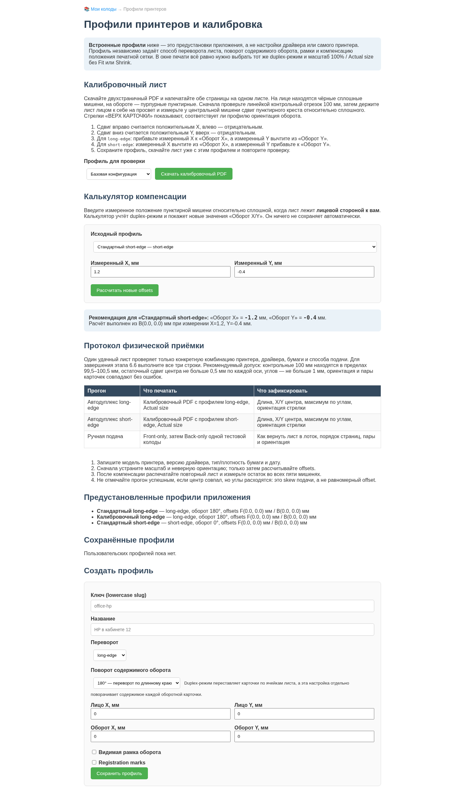

# Руководство пользователя и разработчика

## 1. Назначение и текущая готовность

Приложение хранит несколько колод, позволяет редактировать пары «задание — ответ» и генерирует A4 PDF размером 2 × 4 карточки. PDF строится не браузером: сервер экранирует текст, формирует LaTeX и запускает `pdflatex` во временном каталоге.

Текущая версия подходит для редактирования контента и технического просмотра LaTeX. Программные блокеры `BUG-PRINT-001…003` уже устранены: PDF чередует стороны каждого физического листа, поддерживает long-edge/short-edge transforms, независимые X/Y offsets, registration marks и трактует заданные сантиметры как внешний размер карточки. Для ответственной печати всё ещё нужна физическая проверка на целевом принтере — драйвер может добавлять собственное смещение подачи.

## 2. Установка

### Системные требования

- Python 3.11 или новее (аудит выполнен на Python 3.13.5);
- Flask 3.1;
- `pdflatex` и LaTeX-пакеты `extarticle`, `amsmath`, `mathtext`, `babel` с русским языком, `geometry`, `graphicx`, `enumitem`, `multicol`, `xcolor`;
- современный браузер; Chromium нужен только для регенерации скриншотов.

Установка и запуск:

```bash
python3 -m venv .venv
source .venv/bin/activate
python -m pip install -r requirements.txt
export DIDACTIC_CARDS_SECRET_KEY='replace-with-a-long-random-value'
python app/run.py
```

Встроенный сервер предназначен для локальной разработки и стартует без debug по умолчанию. Явно включить debug можно только переменной `DIDACTIC_CARDS_DEBUG=true`; значения кроме `true/false`, `yes/no`, `on/off`, `1/0` отклоняются, чтобы опечатка не включила небезопасный режим неожиданно.

Production-пример для Linux/WSL:

```bash
export DIDACTIC_CARDS_SECRET_KEY='replace-with-a-long-random-value'
export DIDACTIC_CARDS_DATA_DIR='/srv/didactic-cards/data'
.venv/bin/gunicorn \
  --chdir app \
  --workers 2 \
  --bind 127.0.0.1:8000 \
  --access-logfile - \
  --error-logfile - \
  'run:create_app()'
```

TLS и аутентификацию следует завершать на reverse proxy. Liveness probe — `GET /health/live`; readiness probe — `GET /health/ready`. Readiness возвращает 503, если SQLite integrity/write-transaction check или поиск настроенного TeX executable не прошёл. Ответ показывает только `storage`/`tex: ok|unavailable` и не раскрывает внутренние пути.

Каждый HTTP-ответ содержит новый UUID в `X-Request-ID`; страница ошибки показывает тот же код пользователю. Логи имеют однострочный JSON-формат. Событие `request_completed` содержит method/path/status/duration, а `pdf_compilation` — deck UUID, сторону (`duplex|front|back`), result/error kind и длительность. Содержимое карточек, TeX-log и filesystem paths в эти поля не записываются.

По умолчанию данные сохраняются в абсолютном пути `app/data`, поэтому каталог запуска не меняет выбранную базу. Для отдельной базы используйте, например, `DIDACTIC_CARDS_DATA_DIR=/srv/didactic-cards/data`; каталог будет приведён к абсолютному пути.

Проверка TeX:

```bash
pdflatex --version
kpsewhich mathtext.sty
kpsewhich babel-russian.tex
```

## 3. Работа с приложением

### Колоды

Стартовая страница создаёт, открывает, переименовывает, клонирует и удаляет колоды. Удаление необратимо: корзины и резервной копии пока нет.


Служебный хвост `HTML`, который был виден на исходном audit-снимке, удалён из шаблона; актуальный screenshot переснят после успешной browser-приёмки.

### Добавление карточек

В редакторе доступны четыре пути:

1. Одна карточка — заполнить хотя бы одну сторону и нажать «Добавить карточку».
2. Пакетный ввод — одна карточка на строку.
3. CSV — новый формат использует колонки «секция; лицевая; оборотная», прежние двухколоночные файлы «лицевая; оборотная» также поддерживаются.
4. Редактирование уже добавленной карточки.


Спецификация импорта:

- bulk использует точный разделитель `||`; одиночный `|` остаётся текстом, `\||` вставляет буквальный `||`, `\\` — обратную косую черту;
- CSV должен быть в UTF-8/UTF-8-BOM; auto-mode распознаёт запятую, точку с запятой и tab, также доступен явный выбор;
- checkbox «Первая строка — заголовок» исключает header;
- «Проверить файл» ничего не записывает и показывает accepted/rejected counts; строка более чем с тремя колонками отклоняется, а непосредственный импорт такого файла целиком отменяется.

Пример bulk:

```text
Столица Франции || Париж
$2^5$ || $32$
```

или:

```csv
География,Столица Франции,Париж
Математика,$2^5$,$32$
```

### Формулы и превью

LaTeX-формулы задаются как `$...$` или `$$...$$`. Обычные символы `%`, `&`, `_`, `{`, `}` и другие сервер экранирует. Формулы проходят allowlist: поддерживаются дроби, корни, суммы/интегралы, сравнения, греческие буквы, стандартные функции, простое форматирование и интервалы. Файловые, процессные и macro-команды отклоняются до запуска TeX.


MathJax 3.2.2 вместе с web fonts хранится локально в static assets; приложение показывает явный статус загрузки и не требует CDN. PDF при установленном TeX формирует те же разрешённые формулы независимо от браузерного preview.


Неподдерживаемая команда или нарушенный баланс фигурных скобок возвращает диагностическую ошибку 422. Компилятор запускается с `-no-shell-escape -halt-on-error`.

### Генерация PDF

- Перед генерацией выберите профиль принтера. Встроены «Стандартный long-edge», «Калибровочный long-edge» с рамками/метками и «Стандартный short-edge»; «Базовая конфигурация» использует поля `CardLayoutConfig` без переопределения.
- «Предпросмотр LaTeX» показывает исходник.
- «PDF-превью» компилирует тот же документ и открывает inline PDF в модальном окне; это точнее декоративной HTML-сетки по шрифту, pagination и duplex-порядку.
- «Сгенерировать PDF» запускает `pdflatex` с таймаутом 30 секунд.
- «PDF: только лица» и «PDF: только обороты» создают два согласованных файла для принтера без автоматического duplex. В обоих файлах один PDF-лист соответствует одному и тому же физическому листу колоды; обороты используют ту же выбранную permutation и калибровочные offsets, что и полный duplex PDF.
- «Проверить перед печатью» выполняет read-only компиляцию и показывает пустые стороны, неполный последний лист, выход настроенной сетки за printable area, неподдерживаемые формулы, отсутствующие glyphs и horizontal/vertical overflow. Результат автоматически получает focus и прокручивается в видимую область. Оба вида overflow измеряются внутри конкретной карточки и привязаны к её номеру, стороне и ссылке редактирования; служебные предупреждения внешней TeX-сетки игнорируются. Колода и её `version` не меняются.
- Auto-fit включён по умолчанию: если сторона не помещается при 12pt, TeX последовательно пробует `small`, `footnotesize` и `scriptsize`. Preflight показывает применённое уменьшение как адресный warning. Если содержимое не помещается и на `scriptsize`, это остаётся error — текст следует сократить; молчаливого clipping нет. Deployment может отключить политику через `CardLayoutConfig(auto_fit=False)`.
- Неполный лист дополняется пустыми ячейками до восьми карточек.
- Страницы идут парами физических листов: `front-1, back-1, front-2, back-2, …`.
- По умолчанию используется legacy portrait long-edge: колонки оборота зеркальны, а содержимое каждой оборотной карточки поворачивается на 180°. Перестановка ячеек (`duplex_mode`) и ориентация содержимого (`back_rotation_deg`) независимы; профиль может выбрать 0° или 180°.
- Кириллические названия файлов передаются через RFC 5987 `filename*`; это проверено как Flask contract-тестом, так и реальным Werkzeug/curl запросом.
- Колода ограничена 200 карточками, весь запрос — 2 MiB. Bulk/CSV при превышении лимита отклоняются целиком без частичной записи.
- HTML-формы защищены CSRF-токеном; API принимает JSON и возвращает структурированные 4xx-ответы.
- Ошибка содержимого возвращает 422, недоступный компилятор — 503, timeout — 504; внутренний TeX-лог в production-ответ не включается.

Лицевая страница реального PDF из аудита:


Оборотная страница той же колоды:


На обороте рамка по умолчанию невидима. Стандартный long-edge восстанавливает поворот содержимого на 180°, использовавшийся в первой версии приложения; профиль «Стандартный short-edge» использует 0°. Пользовательский профиль может выбрать оба варианта независимо от способа перестановки ячеек. Печатать нужно с выбранным в приложении и драйвере одинаковым способом переворота, масштабом 100% / Actual size и без `Fit`. Аппаратное смещение и направление стрелки «ВЕРХ КАРТОЧКИ» проверяются калибровочным PDF со страницы профилей.

Для ручной двусторонней печати сначала скачайте оба раздельных PDF и сделайте пробу на одном физическом листе:

1. Напечатайте первую страницу файла `*-fronts.pdf` при масштабе 100% / Actual size.
2. Не меняя ориентацию листа случайно, верните его во входной лоток способом, указанным для вашей модели принтера. Направление подачи и сторона, обращённая вверх, различаются между моделями, поэтому сначала пометьте карандашом верх листа.
3. Напечатайте первую страницу `*-backs.pdf` с теми же форматом бумаги, ориентацией, масштабом и layout-профилем.
4. Проверьте соответствие пары, направление текста и registration marks. Только после этого печатайте всю пачку.
5. Если драйвер выдаёт листы в обратном порядке, включите обратный порядок страниц только для второго прохода. Не переставляйте страницы внутри PDF: их номера уже сопоставлены по физическим листам.

Выбранный профиль применяется одинаково к LaTeX preview, полному/раздельным PDF и preflight. Для каждого HTTP-запроса создаётся отдельный renderer, поэтому одновременная печать с разными профилями не смешивает offsets или поворот. Дополнительные deployment-профили задаются в `AppConfig(printer_profiles=(PrinterProfile(...), ...))`. «Предустановленный профиль приложения» не является настройкой драйвера или памяти принтера: это только набор параметров генерации PDF. Страница «Профили принтеров и калибровка» сохраняет пользовательские измерения в SQLite: ключ — lowercase slug, имя ограничено 100 символами, поворот оборота — 0°/180°, offsets — диапазоном ±10 мм. Предустановленные профили нельзя перезаписать или удалить.



## 4. Хранение данных

Независимо от текущего рабочего каталога:

```text
app/data/cards.sqlite3        # активная транзакционная база
app/data/decks.json           # legacy JSON, сохраняется после миграции
app/data/cards/<deck-id>.json # legacy-карточки, сохраняются после миграции
app/data/legacy-json-backup-v1/ # снимок источника перед первым импортом
```

Активное хранилище — SQLite schema 4: `decks`, `cards`, упорядоченная связь `deck_cards(position)`, `deck_render_settings`, `printer_profiles` и служебная `repository_meta`. Старые schema 1–3 автоматически и транзакционно обновляются без изменения колод. При переходе с schema 2 long-edge профили получают восстановленный поворот 180°, short-edge — 0°; при переходе с schema 3 карточки получают пустую секцию, а существующие колоды — явный `legacy-top-left`, поэтому их прежняя печатная вёрстка не меняется. Новые колоды получают безопасный центрированный preset. Foreign keys включаются для каждого соединения, journal работает в WAL, а изменения колоды, карточек, настроек оформления и профилей выполняются write-транзакциями. Поэтому конкурентные процессы не теряют добавления, а исключение внутри mutation откатывает всю операцию.

Карточки во всех HTML/API URL адресуются стабильным UUID, а не текущим номером строки. Колода имеет монотонную `version`: UI отправляет прочитанную версию с add/edit/delete/reorder/reset, и устаревшая вкладка получает HTTP 409 вместо перезаписи более свежего состояния. Drag-and-drop отправляет упорядоченный список UUID; при сетевой/validation ошибке DOM возвращается в прежний порядок.

### Экспорт и безопасный импорт колоды

В редакторе доступны два download:

- versioned JSON schema 2 содержит deck/card UUID, timestamps, тексты, секции, безопасные настройки оформления и lineage; импорт schema 1 остаётся совместимым и получает legacy defaults;
- UTF-8-BOM CSV использует `;`, header `section;front;back` и стандартное quoting для delimiter/multiline; прежние строки `front;back` принимаются без секции.

На странице списка колод JSON export можно импортировать обратно. Импорт никогда не перезаписывает существующую колоду: создаются новые UUID, `parent_id` новой колоды и карточек указывают на исходные UUID. Schema/type/quota/duplicate-ID validation выполняется до записи, а создание deck + cards проходит одной транзакцией; при ошибке не остаётся пустой или частично импортированной колоды. На этапе 6.1 секция и настройки оформления являются совместимым слоем данных: колонтитулы, управление выравниванием и их UI будут подключены к TeX/HTML renderer на этапе 6.2.

Если `cards.sqlite3` ещё нет, а `decks.json` существует, приложение сначала запускает полный read-only JSON integrity scan. Набор импортируется в одной SQLite-транзакции с сохранением UUID, порядка, timestamps и clone lineage. Единственное безопасно восстанавливаемое расхождение — устаревший денормализованный `card_ids`: порядок берётся из канонического card-файла, JSON не переписывается, а warning сохраняется в `repository_meta`. Любая structural/missing/orphan/duplicate ошибка блокирует импорт. Перед импортом исходники копируются в `legacy-json-backup-v1`; исходные JSON не удаляются. Метка в SQLite не позволяет повторно импортировать позднее изменённый JSON. База с более новой неизвестной версией схемы отклоняется без downgrade.

Legacy JSON schema 1 и его инструменты atomic replace/lock/`.bak` сохранены для аудита и восстановления миграционного источника. Они больше не являются рабочим backend после успешного импорта.

Проверка и контролируемое восстановление:

```bash
python scripts/check_storage.py
python scripts/check_storage.py \
  --backend json \
  --recover 'cards/<deck-id>.json' \
  --yes
```

В auto-режиме утилита выбирает SQLite, если `cards.sqlite3` уже существует. Recovery разрешён только с `--backend json` и только для `decks.json`, `repository.json` и JSON внутри `cards/`. Перед заменой команда проверяет соседний `.bak`, а текущий повреждённый файл перемещает в `.broken-<UTC timestamp>`. Это локальная последняя версия, а не полноценная стратегия backup: перед миграциями по-прежнему копируйте весь `app/data` во внешнее хранилище.

## 5. Архитектура

```text
Browser / HTML / JSON API
          |
      Flask blueprint
          |
  card/deck use cases
          |
  +-------+----------------+
  |                        |
SqliteRepository     LatexRenderer
  |                        |
JSON files             PdfLatexCompiler
                           |
                        A4 PDF
```

- `domain/entities.py`: карточка, метаданные колоды, рабочая `CardDeck`.
- `use_cases/`: CRUD, импорт, padding, preview и generate.
- `adapters/sqlite_repository.py`: активное transactional/WAL-хранилище и одноразовый legacy import.
- `adapters/json_repository.py`: проверка, backup и recovery исходного JSON.
- `adapters/latex_renderer.py`: физическая сетка и зеркалирование.
- `web/blueprint.py`: HTML и AJAX endpoints.
- `xelatex_compiler.py`: протестированная альтернативная реализация компилятора; активная конфигурация пока использует `pdflatex`.

`CardLayoutConfig` задаёт внешний cut size `9.3 × 6.3 см`, 2 столбца, 4 ряда, `fboxsep=8pt`, толщину рамки, базовый `duplex_mode` и `back_rotation_deg`. Внутренняя `minipage` автоматически уменьшается на padding и border, поэтому они не увеличивают физическую рамку. `PrinterProfile` переопределяет duplex mode, поворот содержимого оборота, рамку, метки и поля `front_offset_x_mm`, `front_offset_y_mm`, `back_offset_x_mm`, `back_offset_y_mm` в диапазоне ±10 мм; размеры и сетка остаются общими для приложения.

Рекомендуемый цикл калибровки:

1. На странице профилей выберите базовый или сохранённый профиль и скачайте двухстраничный calibration PDF.
2. Напечатайте обе страницы на одном физическом листе с масштабом 100% / Actual size, без Fit/Shrink и с тем же `long-edge` либо `short-edge`, который выбран в приложении. Проверьте, что стрелка «ВЕРХ КАРТОЧКИ» на обороте ориентирована ожидаемо; иначе смените поворот 0°/180°, не меняя калибровочные offsets.
3. Измерьте контрольный отрезок: он должен быть ровно 100 мм. Если длина иная, сначала отключите масштабирование драйвера — offsets не исправляют scale.
4. Держите лист лицом к себе на просвет. У центральной мишени измерьте положение пунктирного пурпурного креста оборота относительно сплошного чёрного: вправо/вниз — положительные X/Y, влево/вверх — отрицательные.
5. Для `long-edge`: новое `back_offset_x_mm = старое + X`, новое `back_offset_y_mm = старое − Y`. Для `short-edge`: новое `back_offset_x_mm = старое − X`, новое `back_offset_y_mm = старое + Y`.
6. Сохраните профиль, скачайте лист с ним и повторите проверку. Четыре угловые пары мишеней помогают отличить равномерный сдвиг от перекоса подачи бумаги.

## 6. Тесты и воспроизводимость аудита

```bash
python -m pip install -r requirements-dev.txt
python -m pytest -q
python -m pytest --cov=didactic_cards --cov=run --cov=config --cov-branch
```

Все исходные `xfail(strict=True)` после исправлений сохранены как обычные regression-тесты; известных исполнимых дефектов без обычного passing contract больше нет.

Текущее состояние основного набора: 393 проходящих теста, 0 `xfail`, общий branch coverage 98,43%. В него входят schema 1/2/3→4 migrations, обратная совместимость JSON schema 1→2 и двух-/трёхколоночного CSV, version/clone-контракты секций и настроек оформления, а также unit/HTTP-контракты observability/production health, сохраняемых профилей, независимого поворота оборота, auto-fit, раздельной печати и preflight. Реальные TeX-проверки подтверждают: колода на 16 карточек даёт два листа в `fronts.pdf` и два листа в `backs.pdf`, длинная сторона уменьшается до `footnotesize`, чрезмерная оставляет адресный overflow-маркер, а калибровочный документ компилируется как двухстраничный A4 PDF. Raster regression калибровки проверяет все пять мишеней в ожидаемых координатах на обеих страницах; отдельный координатный oracle проверяет четыре регистрационных креста (восемь штрихов) на front/back уже после единственного прохода TeX. Обычные страницы дополнительно сравниваются с монохромными golden fixtures 596×842 с допуском 0.2% пикселей. Отдельный Chromium E2E проходит полный offline workflow, включая focus/scroll результата preflight, на временной SQLite-базе.

Golden fixtures обновляются осознанной отдельной командой после визуальной проверки изменения раскладки:

```bash
python scripts/update_print_goldens.py
```

Скриншоты можно переснять на запущенном приложении:

```bash
python scripts/capture_screenshots.py \
  --base-url http://127.0.0.1:5000 \
  --deck-id <UUID-колоды> \
  --output-dir docs/images
```

Скрипт использует системный Chromium, адресует карточку стабильным UUID, дополнительно снимает страницу профилей и не скачивает собственный браузер. Актуальный набор снимков переснят 22.08.2026 после успешного E2E.

## 7. Диагностика

- `Exec format error` у `venv/bin/python`: удалите/не используйте непереносимое окружение и создайте `.venv` заново.
- `pdflatex not found`: установите TeX Live и проверьте `pdflatex --version`.
- Страница ошибки LaTeX: откройте полный лог, найдите первую строку, начинающуюся с `!`.
- Формулы видны как `$x^2$`: проверьте статус локального MathJax и HTTP-загрузку `/cards/static/vendor/mathjax/tex-mml-chtml.js`; это не обязательно означает сбой PDF.
- Колоды «пропали»: проверьте `DIDACTIC_CARDS_DATA_DIR`; без этой переменной приложение всегда использует `app/data`.
- Ошибка повреждения хранилища: сначала выполните `python scripts/check_storage.py` и скопируйте весь каталог; затем восстановите только указанный в отчёте файл через `--recover ... --yes` или вручную после проверки `.bak`.
- PDF не скачивается: проверьте HTTP-статус и первую диагностическую строку; кириллические имена поддерживаются.
- `/health/live` отвечает 200, а `/health/ready` — 503: процесс жив, но проверьте доступ на запись к `DIDACTIC_CARDS_DATA_DIR` и наличие `pdflatex` в `PATH`.
